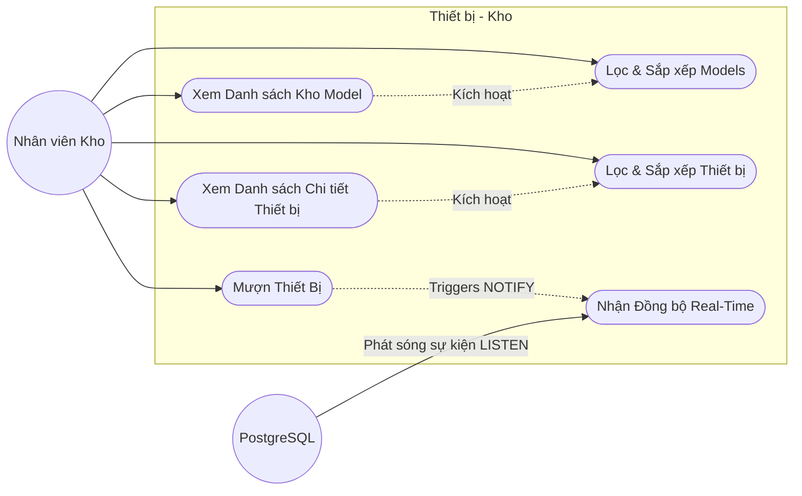
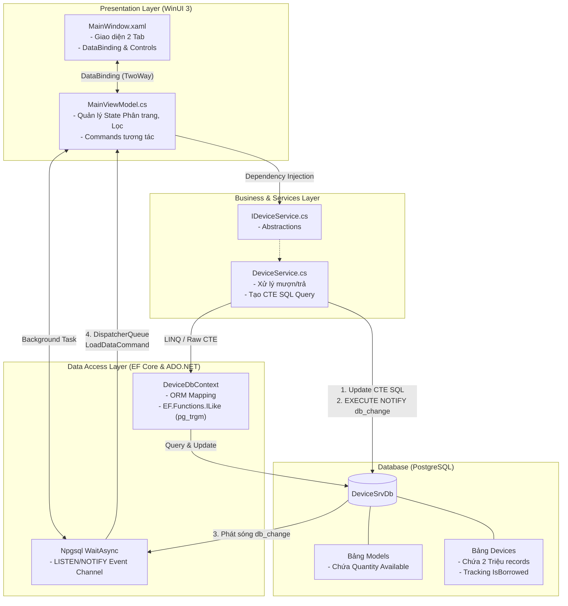

# Design Document: Device Management System

Tài liệu này mô tả Sơ đồ Use Case (Use Case Diagram) và Thiết kế Mức Cao (High-Level Design / Architecture) của ứng dụng quản lý thiết bị `DeviceSrv`.

## 1. Biểu đồ Use Case (Use Case Diagram)

Sơ đồ dưới đây thể hiện các tương tác chính của người dùng (Inventory Staff) với hệ thống quản lý thiết bị.

**Chi tiết Use Case:**
*   **Xem Danh sách Kho Model / Thiết bị**: Người dùng mở ứng dụng và mặc định sẽ thấy danh sách kho tương ứng qua cơ chế Tab.
*   **Lọc & Sắp xếp**: Người dùng có thể tìm kiếm dữ liệu trên từng cột (Category, Name, Manufacturer,...) và sắp xếp Asc/Desc (Kết hợp cả 2 logic).
*   **Mượn Thiết bị**: Người dùng nhập số lượng `Quantity` và nhấn Borrow tại bảng Model. Hệ thống sẽ khóa và trích xuất thiết bị từ cơ sở dữ liệu.
*   **Nhận Đồng bộ Real-Time**: Chức năng thụ động, các Instances đang mở sẽ tự động nạp lại dữ liệu khi DB gửi tín hiệu.

---

## 2. Thiết kế Kiến trúc Thượng tầng (High-Level Design - HLD)

Kiến trúc hệ thống của `DeviceSrv` tuân thủ mô hình **MVVM (Model-View-ViewModel)** trên nền tảng **WinUI 3**, kết hợp **Dependency Injection** và nguyên tắc **SOLID**. Điểm nhấn đặc biệt nằm ở cơ chế đồng bộ đa tiến trình (Multi-instance Sync) qua Background Channel.

### Giải thích các thành phần:

1.  **Presentation Layer**: 
    *   Chia làm View (Giao diện XAML) và ViewModel. View không chứa bất cứ Logic nghiệp vụ nào.
    *   Tất cả Event (Click, TextChange) đều trigger Command trong ViewModel thông qua cơ chế `x:Bind` (DataTemplate).
2.  **Business Layer**:
    *   Là trái tim xử lý nghiệp vụ, được đăng ký Singleton tại DiContainer ([App.xaml.cs](file:///d:/dev/devicesrv/SRV/SRV/App.xaml.cs)).
    *   Tách biệt hẳn với UI, nhận vào Pagination rules (Filter string, Page index) và xử lý.
3.  **Data Access Layer**:
    *   Sử dụng **EF Core 8** cho những tác vụ truy xuất Pagination có Index `pg_trgm` để tăng tối đa tốc độ `ILIKE` Search.
    *   Sử dụng **Raw SQL (Common Table Expression - CTE)** ở những API cần tính hiệu năng khắt khe (VD: Cập nhật 2 triệu record đồng thời) tránh tràn bộ nhớ RAM (Memory-Leakage do Tracking của EF).
4.  **Real-Time Sync Workflow (Listen/Notify)**:
    *   Mỗi cửa sổ WinUI sẽ giữ một thread ngầm (`conn.WaitAsync()`) qua ADO.NET Npgsql Connection chỉ để "hóng" sự kiện `LISTEN db_change`.
    *   Bất kỳ Instance (hay PC) nào gọi hàm mượn thiết bị thành công `DeviceService.BorrowDevicesAsync()`, dòng lệnh cuối cùng sẽ chọc xuống DB: `NOTIFY db_change`.
    *   Database lập tức vẩy tín hiệu cho tất cả các máy trạm đang có Thread Listener, qua đó gọi lại bộ nạp màn hình lập tức `LoadDataCommand.Execute(null)`. Tốc độ phản hồi thường dưới mức `50 mili-giây`.

---

## 3. Biểu đồ Sequence (Sequence Diagram) - Luồng Mượn Thiết Bị Đồng Bộ

Sơ đồ dưới đây minh hoạ chi tiết vòng đời (Lifecycle) từ khi Nhân viên A nhấn nút Borrow cho tới khi giao diện của Nhân viên B (trên máy khác) tự động hiển thị dữ liệu mới ngầm định qua Trigger.

```mermaid
sequenceDiagram
    autonumber
    actor NV_A as Nhân Viên A
    participant App_A as WinUI Instance A
    participant DB as PostgreSQL DB
    participant App_B as WinUI Instance B (Máy khác)
    actor NV_B as Nhân Viên B

    Note over App_B,DB: Instance B đang chạy Background Thread<br/>(NpgsqlConnection.WaitAsync) chờ sự kiện.

    NV_A->>App_A: Nhập Quantity = N & Bấm nút "Borrow"
    App_A->>DB: Gửi yêu cầu BorrowDevicesAsync(modelId, N)
    
    rect rgb(30, 30, 30)
        Note over App_A,DB: Thực thi Database Transaction
        DB->>DB: Chạy CTE SQL Update "Devices" (IsBorrowed = true)
        DB->>DB: Chạy Update đồng bộ số lượng "Available" ở bảng "Model"
        App_A->>DB: Lệnh "NOTIFY db_change"
    end
    
    DB-->>App_A: Commit Query Thành công
    App_A->>NV_A: (Auto-trigger Load) Cập nhật UI Instance A
    
    Note over DB,App_B: EVENT PUSH CHỦ ĐỘNG TỪ DATABASE
    DB-)App_B: Tín hiệu Asynchronous NOTIFY (db_change)
    
    App_B->>App_B: Kích hoạt .Notification event (DispatcherQueue Thread)
    App_B->>DB: Gửi yêu cầu LoadModelsAsync & LoadDevicesAsync
    DB-->>App_B: Trả về kết quả Models mới và list Devices (có dòng IsBorrowed = true)
    
    App_B->>NV_B: UI tự động Render lại.<br/>Hiện cảnh báo Đỏ thiết bị đã mượn mà NV_B không cần thao tác!
```

