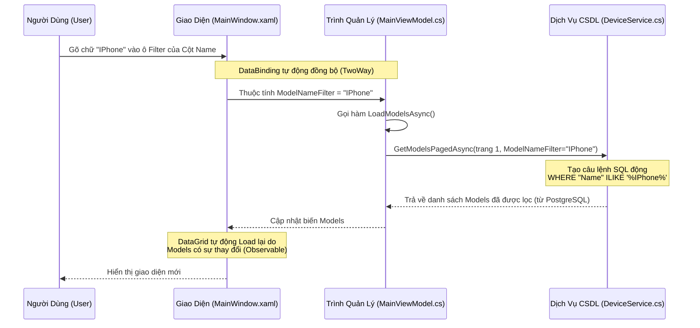

# Luồng Hoạt Động Của Chức Năng Lọc (Filter Flow)

Dưới đây là sơ đồ và lời giải thích chi tiết về cách dữ liệu đi từ lúc bạn gõ phím cho đến khi hiện kết quả từ cơ sở dữ liệu.

## Mô Hình Kiến Trúc Lọc (MVVM Pattern)

Luồng ứng dụng này sử dụng mẫu kiến trúc chuẩn của WinUI 3 gọi là **MVVM** (Model - View - ViewModel). Ý tưởng chính là giao diện (View) không bao giờ trực tiếp lấy dữ liệu từ database (Model), mà phải thông qua một người quản lý ở giữa là `ViewModel`.



## Các Bước Thực Hiện Chi Tiết

Dưới đây là 3 bước cơ bản quá trình này diễn ra trong Code của ứng dụng:

### BƯỚC 1: Lắng Nghe Từ Giao Diện (XAML)
Khi bạn gõ vào ô tìm kiếm:
```xml
<!-- Bên trong MainWindow.xaml -->
<TextBox Text="{Binding Source={StaticResource Proxy}, Path=Data.ModelNameFilter, Mode=TwoWay, UpdateSourceTrigger=PropertyChanged}"/>
```
- Nghĩa là TextBox này đang "bị buộc" (**Binding**) vào một đoạn Code C# ở dưới nền là hàm `ModelNameFilter`.
- Tính năng **`UpdateSourceTrigger=PropertyChanged`** rất quan trọng vì nó bảo App rằng: *"Cứ mỗi lần người dùng gõ thêm 1 ký tự, hãy lập tức cập nhật biến kia ngay thay vì chờ người dùng ấn Enter"*.

### BƯỚC 2: Cập Nhật Trạng Thái (ViewModel)
Giao diện nói chuyện với kho Code C# qua biến này:
```csharp
// Bên trong MainViewModel.cs
private string _modelNameFilter = "";
public string ModelNameFilter
{
    get => _modelNameFilter;
    set
    {
        // Khi gõ "IPhone", XAML sẽ gửi chữ "IPhone" vào `value`
        if (_modelNameFilter != value)
        {
            _modelNameFilter = value;
            OnPropertyChanged(nameof(ModelNameFilter)); 
            
            // Lệnh này bắt buộc App phải khởi động lại chức năng lấy Dữ Liệu
            _ = LoadModelsAsync();
        }
    }
}
```

### BƯỚC 3: Truy Vấn Dữ Liệu Dưới Server (Service)
Sau khi hàm `LoadModelsAsync` được gọi, nó sẽ nhờ `DeviceService.cs` kết nối với cơ sở dữ liệu để lọc thông qua cú pháp SQL:
```csharp
// Bên trong DeviceService.cs

// Hàm GetModelsPagedAsync sẽ tạo ra một đoạn truy vấn (Query) bằng chuẩn SQL
var sqlCount = @"SELECT COUNT(*) FROM public.""Models"" WHERE 1=1";
var sqlData = @"SELECT * FROM public.""Models"" WHERE 1=1";

if (!string.IsNullOrEmpty(nameFilter))
{
    // Nó lấy Text bạn vừa nhập, ví dụ "IPhone", để thêm vào lệnh gọi CSDL.
    // Lệnh `%IPhone%` nghĩa là tìm tất cả các tên chứa chữ "IPhone" bên trong
    var filter = $" AND \"Name\" ILIKE @NameFilter";
    sqlCount += filter;
    sqlData += filter;
}
```

> [!TIP]
> Việc để Server của PostgreSQL lọc dữ liệu (Bằng lệnh `ILIKE`) gọi là **Server-side Filtering**. Nó nhanh hơn gấp hàng ngàn lần so với việc tải toàn bộ hàng triệu thiết bị về máy tính dể lọc tay (Client-Side Filtering).

**Tóm lại:**
`Ô gõ chữ (UI)` => Tự Update cho `Biến C# (ViewModel)` => C# ra lệnh chạy `SQL Filter (Service, DB)` => `Database` gửi kết quả lên => `UI` vẽ lại giao diện.
